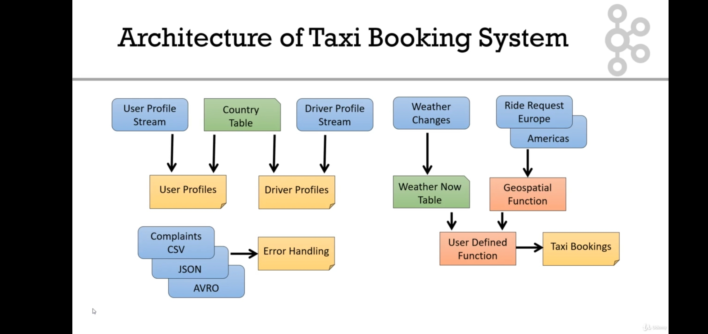

# Udemy Kafka

[https://www.udemy.com/course/apache\-kafka/](https://www.udemy.com/course/apache-kafka/)

- Course completion certificate: [https://www.udemy.com/certificate/UC\-82d2aa28\-046b\-4b71\-afe2\-8f6e593d490a/](https://www.udemy.com/certificate/UC-82d2aa28-046b-4b71-afe2-8f6e593d490a/) 
- Summary:
    - Great introduction to Kafka, new material for me as I haven't done any stream processing or real time analytics before. I'm pretty familiar with time series / windowing as I have a background in Digital Signal Processing. 
    - Once you learn Kafka, all the cloud native stream processing solutions like AWS Kinesis, GCP Pub/Sub, etc. will be easy to pick up.
    - **Partially completed this course**: I mainly used this course for the Kafka architecture part. I skipped the programming project in Java in favor of lab practice in python with GCP Dataflow, see: [https://www.cloudskillsboost.google/paths/16](https://www.cloudskillsboost.google/paths/16)
- Github repos for course:
    - [https://github.com/conduktor/kafka\-beginners\-course](https://github.com/conduktor/kafka-beginners-course)
- Apache Kafka
    - open sourced by linkedin
    - distributed, scalable: 100s of brokers, millions of messages per second
    - Kafka latency less than ****10ms**** real time, high performance throughput
    - max throughput ****~800 MB/s****?, limited by network? Gigabit ethernet, etc.
    	- https://aws.amazon.com/blogs/big-data/best-practices-for-right-sizing-your-apache-kafka-clusters-to-optimize-performance-and-cost/
- Kafka \(Confluent, AWS MSK serverless\) vs Kinesis
    - kinesis easier to setup, kafka harder to set up (kafka kraft cluster, connectors, condukctor), but more powerful
    - [https://streamsets.com/blog/kafka\-vs\-kinesis/](https://streamsets.com/blog/kafka-vs-kinesis/)
    - [https://dev.to/aws\-builders/aws\-msk\-confluent\-cloud\-aiven\-how\-to\-chose\-your\-managed\-kafka\-service\-provider\-15m0](https://dev.to/aws-builders/aws-msk-confluent-cloud-aiven-how-to-chose-your-managed-kafka-service-provider-15m0)
        - AWS MSK cheaper, better integrated with AWS security than confluent, plus they have the serverless version
    - [https://medium.com/slalom\-build/a\-guide\-to\-choosing\-the\-right\-streaming\-solution\-for\-you\-on\-aws\-57089f03e034](https://medium.com/slalom-build/a-guide-to-choosing-the-right-streaming-solution-for-you-on-aws-57089f03e034)
    - https://programmaticponderings.com/2023/04/23/streaming-data-on-aws-amazon-kinesis-data-streams-or-amazon-msk/
    - https://www.softkraft.co/aws-kinesis-vs-kafka-comparison/ 
- kafka cluster
    - producers
        - push based to topics
        - round robin
        - key based ordering
        - acks strategy
    - brokers
        - topics
        - partitions
        - replications
        - partition leader and in\-sync replicas
        - offsets topic
    - consumers
        - pull based from topics
        - consumer offsets
        - consumer groups
        - at least once
        - at most once
    - cluster managers
        - zookeeper \(old\)
            - leader follower
            - broker management
        - kraft \(new\)
- Conduktor [https://www.conduktor.io/](https://www.conduktor.io/)
    - Confluent provides managed Kafka clusters that you can build applications on. Conduktor makes it easy to manage the internals of your Kafka clusters. Essentially, Conduktor sits on top of Confluent's service, making it easier to do everything in Kafka.
- Kafka Connect  [https://youtu.be/Jkcp28ki82k](https://youtu.be/Jkcp28ki82k) 
    - Connectors
        - [https://www.confluent.io/product/connectors/](https://www.confluent.io/product/connectors/) 
        - [https://www.confluent.io/hub/](https://www.confluent.io/hub/) 
    - Separate Kafka Connect cluster, has worker that run tasks
        - standalone \(only single worker\) vs distributed mode \(default, run on single node, multiple workers, fault tolerant\)
        - can have multiple clusters
    - Connector to source / sync
        - different from Kafka producers / consumers
    - Single Message Transforms
    - Converter \(data to byte serializer\): transmit bytes on Kafka
- Kafka Streams [https://www.udemy.com/course/kafka\-streams/](https://www.udemy.com/course/kafka-streams/)
    - Kafka Streams course, in Java. Skipped in favor of the KSQL course \(see below\)
- Confluent **Schema Registry**
    - keep topic schemas for producers / consumers
- Kafka Topics
    - Topics
        - a particular stream of data
        - like a table in a database
        - any kind of message format
        - data stream: sequence of messages
    - Partitions
        - Topics are split into partitions
        - messages within each partition are ordered
        - each message within a partition gets an incremental id, called **offset**
            - offset only has a meaning for a specific partition
            - offsets are not reused
        - topics are immutable
        - data is kept for a limited time \(default 1 week\)
        - **order is guaranteed only within a partition, not across partitions**
        - data is assigned randomly to a partition unless a key is provided
    - replication factor \> 1 \(2 or 3\)
        - only 1 broker is the leader
- Producers
    - write data to partitions
        - know which topic, partition, and broker to write to
        - can only write to the leader broker for a partition
        - can choose to receive ack for write
            - ack 0: possible data loss
            - ack 1: wait for leader ack, possible data loss
            - ack all: no data loss
    - message keys
        - can choose to send a key with the message \(string, number, binary\)
            - goes to same partition \(hashing\)
                - key hashing maps key to partition
            - use key if you need to keep message ordering
        - null key: round robin partitions
    - message
        - key \(nullable\)
        - value \(nullable\)
        - compression type \(none, gzip, etc.\)
        - headers: optional key / value
        - partition \+ offset
        - timestamp \(system or user set\)
    - message serializer / deserializer
        - bytes: input from producers is in byte format, kafka outputs bytes to consumers
        - string
        - int, float
        - avro
        - protobuf
- Consumers
    - read data from a topic \(identified by name\) \- pull model
        - know which broker to read from
            - read from leader broker for a partition
        - data is read in order from low to high offset within each partition
    - consumer groups
        - more consumers than partitions, some consumers will be inactive
        - can have multiple consumer groups on the same topic
            - different groups read from different partitions on the same topic
    - consumer offsets
        - store the offsets at which the consumer group has been reading
        - after data has been processed, consumer offset needs to be updated by consumer in group
    - delivery semantics
        - **at least once**
            - same message can be read multiple times
        - **at most once**
            - message can only be read once, then it is deleted
        - **exactly once**
- Brokers
    - kafka cluster composed of multiple brokers \(servers\)
        - connect to any broker \(bootstrap server\) \-\-\> connect to entire cluster
    - broker id
    - each broker contains certain topic partitions
        - broker 101
            - topic A partition 0
            - t B p 1
        - broker 102
            - t a p 2
            - t b p 0
        - broker 103
            - t a p1
- cluster managers
    - cluster manager: manages brokers \(keeps list of brokers, selects leader election of partitions\)
    - zookeeper \(old\)
        - scaling issues clusters \> 100k partitions
    - kraft \(new\) Kafka Raft
        - Kafka 3\+
        - 1 millions of partitions
- Kafka install
    - zookeeper mode or kraft mode
- conduktor
    - can see topics
    - schema registry
    - consumer groups
    - kafka connect
    - brokers
- Kafka CLI
    - [kafka\-topics.sh](http://kafka-topics.sh)
        - create, list, describe, increase partitions, delete topics
    - [kafka\-console\-producer.sh](http://kafka-console-producer.sh) 
        - produce with and without keys
    - [kafka\-console\-consumer.sh](http://kafka-console-consumer.sh)
        - consume from beginning or tail of topic
        - show both key and values in the output
    - [kafka\-consumer\-in\-groups.sh](http://kafka-consumer-in-groups.sh) 
        - consumer groups: see how partitions read are divided among multiple CLI consumers
    - [kafka\-consumer\-groups.sh](http://kafka-consumer-groups.sh)
        - list, describe, delete consumer groups
        - start / stop console consumer
    - [reset\-offets.sh](http://reset-offets.sh) 
        - reset offsets
        - start console consumer and see the outcome
- Kafka project using Java
    - set up a project with Kafka producers / consumers in Java
        - wikimedia stream \(producer\) \-\-\> kafka cluster \-\-\> opensearch \(elasticsearch\) \(consumer\)
    - skipped this section in favor of lab practice in python with GCP Dataflow, see: [https://www.cloudskillsboost.google/paths/16](https://www.cloudskillsboost.google/paths/16)
        - This is similar to the AWS Data Engineer [https://www.udemy.com/course/aws\-data\-analytics](https://www.udemy.com/course/aws-data-analytics) lab with Kinesis
- Real world Kafka architectures and case studies \(useful section\)
    - two most important parameters when creating a topic: partition count, replication factor
        - **can apply this to other streaming technologies like Kinesis, etc.**
        - partition count
            - each partition can handle a throughput of a few MB/s
            - more partitions
                - better parallelism, better throughput
                - ability to run more consumers in a group to scale \(max as many consumers per group as partitions\)
                - ability to leverage more brokers if you have a large cluster
                - but more elections to perform for Zookeeper
                - but more files to open on Kafka
            - **guidelines: partitions per topic**
                - small cluster \(\< 6 brokers\): 3 x \# brokers
                - big cluster \(\> 12 brokers\): 2 x \# of brokers
                - adjust for number of consumers you need to run in parallel at peak throughput
                - adjust for producer throughput
                - **TEST\!**
        - replication factor
            - at least 2, usually 3, max 4
            - guidelines
                - **set it to 3 to get started**, must have at least 3 brokers
                - if rep performance an issue, get a better broker instead of less RF
                - never set to 1 in production
    - topics naming convention
        - message type
            - logging, queuing, tracking, **etl/db**, streaming, push, user
        - dataset name: database name in RDBMS systems
        - data name: table name
        - data format: avro, json, text, protobuf, csv, log
    - case studies
        - movieflix
            - sample kafka implementation for real time movie recommendations on streaming service
        - gettaxi
            - sample kafka implementation for ride sharing app
        - mysocialmedia
            - sample kafka implementation for real time social media post, comment, etc. sharing
        - mybank
            - sample kafka implementation for real time banking app
            - producers: a lot of CDC streams from PostgreSQL, SQL Server, etc databases for banking transactions
                - trigger alerts, etc.
        - big data ingestion
            - kafka connect sink: S3, Snowflake, etc.
            - KSQLDB: speed layer of lambda architecture
                - Flink, Spark structured streaming, etc.
        - logging and metrics aggregation
            - kafka connect sink: splunk, cloudwatch, opensearch / elasticsearch, etc.
            - topics
                - application\_logs
                - application\_metrics
- kafka in the enterprise for admins
    - skipped this section, can always come back to it later when needed
    - kafka cluster set up, monitoring, operations, security
- advanced kafka
    - skipped this section, can always come back to it later when needed
    - changing topic config
    - segment and indexes
    - log cleanup policies
    - log compaction theory and practice
    - unclean leader election
    - large messages in kafka
- Message Bus (Kafka - atomic messages) vs Streaming Framework (Flink, Storm, etc. - continuous aggregations)
	- Streaming ETL / Analytics (Kafka Consumer): Kafka Streams / KSQL / Faust, Kinesis Data Analytics (SQL), Flink (Java / Scala), Spark streaming (SQL) / Delta Live Tables, Rising Wave (SQL), Beam / Dataflow
 	- RabbitMQ (push based) vs Kafka (pull based, more complex systems) https://www.upsolver.com/blog/kafka-versus-rabbitmq-architecture-performance-use-case

## Udemy KSQL

[https://www.udemy.com/course/kafka\-ksql/](https://www.udemy.com/course/kafka-ksql/)

- Course completion certificate: [https://www.udemy.com/certificate/UC\-510b1e24\-cc7f\-40a8\-bb30\-a96b6acf8d31/](https://www.udemy.com/certificate/UC-510b1e24-cc7f-40a8-bb30-a96b6acf8d31/) 
- Summary:
    - Supplementary course to the Kafka introduction course. Good background info to know.
    - Course is a combination of lectures showing each topic, and how to use KSQL for each topic.
    - Similar to Kinesis Data Analytics, GCP Dataflow courses.
    - KSQL just like querying SQL table in a database or data warehouse, pretty straightforward.
- Github repos for course:
- Lecture notes: [README.pdf](./Kafka/file/README.pdf)
- KSQL
    - labs
        - linux prompt
        - ksql prompt
    - SQL interface on top of Kafka Streams \(Java, Scala\)
        - KSQL CLI: **ksql** command
            - list topics
        - python KSQL
    - Kafka Producer or Kafka Connect Source \-\-\> KSQL creates Kafka Streams app \-\-\> write back to Kafka \-\-\> Kafka Consumer or Kafka Connect Sink
    - create RT analytics dashboard for game
- Install KSQL
- KSQL project
    - **Possible real time updating dashboards:**
        - **KSQL real time query \(continuous, windowing aggregation, etc\) \-\-\> kafka connect \-\-\> kinesis data stream \-\-\> redis \-\-\> AWS quicksight dashboard, etc.**
        - **Kinesis Data Analytics \(using SQL [https://docs.aws.amazon.com/kinesisanalytics/latest/dev/what\-is.html](https://docs.aws.amazon.com/kinesisanalytics/latest/dev/what-is.html) \) \-\-\> kinesis data stream \-\-\> redis \-\-\> AWS quicksight dashboard, etc.**
        - **Microsoft Fabric \(most modern tech\): eventstream \-\> KQL real time database \-\-\> KQL queryset \-\-\> Power BI dashboard**
            - [https://learn.microsoft.com/en\-us/fabric/real\-time\-analytics/overview](https://learn.microsoft.com/en-us/fabric/real-time-analytics/overview) 
    - architecture of a taxi booking system
        - 
    - streams, tables, joins
        - you can join tables and streams together to create a new stream
        - join stream \+ stream = stream
        - join table \+ table = table
    - data encoding, manipulation, enrichment
    - time based window concepts
    - advanced data handling
        - geospatial and UDFs
    - moving to production
        - load balancing and horizontal scaling
- KSQL streams
    - Streams
        - full history of messages in Kafka
            - example: web site click stream, orders arriving, twitter
        - messages
            - constantly being added to topic
            - independent
            - time ordered
            - can be processed independently
        - **push vs pull queries**
        - SET 'auto.offset.reset' = 'earliest';
            - where to start KSQL query from topic
    - use KSQL CLI
        - command: kafka\-console\-producer ...
            - insert JSON message to producer
    - create a stream with JSON, CSV, AVRO, etc.
    - **KSQL Datagen**: generate test streams
        - ksql\-datagen CLI tool
        - use provided custom schema
        - can generate streams of CSV, JSON, AVRO
        - control rate that messages are produced
        - set max number messages produced
    - stream manipulation
    - streams from streams and functions
        - build stream from stream using case statement
        - RUN SCRIPT: run script of ksql commands
            - **run script** 'user\_profile\_pretty.ksql';
                - see Github repo for all course files
        - drop stream
        - running streams
            - find active streams
            - show extended details & metrics
            - terminate query
    - KSQL tables
        - a **table** in Kafka is the state 'now'
            - e.g. stock level, web traffic seen in a time period, current weather
        - a message for a table
            - updates the previous message in the set with the same key
            - adds a new message when there is no message with the same key
        - create table with CSV
            - specify key
- KSQLDB
    - KSQL joins
        - you can join tables and streams together to create a new stream
        - join stream \+ stream = stream
        - join table \+ table = table
        - requirements
            - same partitioning for join fields
            - for tables
                - key must be VARCHAR or STRING
                - Kafka message key must be the same as the contents of the column set in KEY
    - pull queries
        - only supported on aggregate table
        - must query against rowkey
    - Kafka connect with KSQLDB
        - control Kafka connect with KSQLDB
        - create postgres DB CDC \-\-\> Kafka Connect Source
    - data encodings
        - CSV data
            - complaints stream
        - JSON data
            - bad data: see KSQL server logs
        - avro data
            - JSON \+ schema
                - stored in binary format
                - KSQL relies on confluent schema registry
            - byte serialization
                - can be segmented
            - [kafka\-avro\-console\-producer.sh](http://kafka-avro-console-producer.sh) 
    - avro schema evolution
        - add field to complaints schema
        - Confluent Control Center: visualize schema evolution, localhost:9021
            - cluster
                - brokers
                - topics
                - connect
                - KSQL
                    - KSQL interactive mode
                - consumers
                - cluster settings
            - Zookeeper, Kafka
            - Schema Registry, KSQL
    - nested JSON
    - build a rekeyed table
    - repartition a stream
    - **merging streams**
        - combine streams together
            - INSERT INTO some\-stream SELECT from another\-stream
        - must be identical schema
        - can combine 2 or more
        - example
            - global stream of taxi rides merging EU and US streams
    - windowing
        - standard stuff: tumbling \(no overlaps\), hopping \(overlaps\), session
        - can apply to streams and tables
        - within our windows
            - we can aggregate: e.g. count\(\*\)
            - we can group
            - misc
                - COLLECT\_LIST
                - TOPK
                - WindowStart\(\) and WindowEnd\(\)
    - geospatial
        - GEO\_DISTANCE: lat, long
- User Defined Functions UDF
    - scalar function
    - UDAF: UD Aggregate Function
        - input: many input rows
        - output: one value
    - Java function \-\> jar
- production
    - two deployment options for KSQL
        - head \(interactive mode\)
            - KSQL CLI
            - Confluent Control Center
            - REST API via curl, python script
        - headless mode
            - for production
            - scripted only
            - build an application file, start up headless server
    - **explain plan**
        - pretty standard stuff
        - show the query plan of a query
        - use id of running query
        - show the execution plan
        - runtime info and metrics
        - visualize the plan
            - **kstreams topology viewer**
    - scaling and load balancing
    - config settings
        - specified at the KSQL server \(ksql\-server.properties\) or session
    - state stores
        - store data for stateful operators \(windowing, joins, aggregate functions\)
        - stored in RockDB db \(low latency key value store\)
    - testing
        - **ksql\-test\-runner**
            - run on ksql script file that has tests

Snowplow
- Customer data augmentation in real time (structured behavioral data)

## Streaming system design
- https://www.linkedin.com/posts/nagarajulu_systemdesign-probablisticdatastructures-performace-activity-7096705093797875712-E7bv/
    - filter out streaming inputs
- Popular streaming technologies
	- https://www.youtube.com/watch?v=2zEYG2p0TRo
	- https://www.linkedin.com/pulse/spark-streaming-vs-flink-storm-kafka-streams-samza-choose-prakash
 	- https://blog.scottlogic.com/2018/07/06/comparing-streaming-frameworks-pt1.html
  	- https://www.youtube.com/watch?v=K-NYuwzpvEM
	- Flink
		- Flink real stream processing framework, lower latency, less throughput than Spark streaming, Java based
		- does both streaming and batch
		- but kinesis data analytics is based on Flink and is SQL based (streaming analytics)
		- https://tech.dream11.in/blog/navigating-the-streamverse-a-technical-odyssey-into-advanced-stream-processing-at-dream11 
	- Spark Streaming (streaming ETL, streaming analytics)
 		- https://youtu.be/qlJmjkgHZ88?si=pJ2KTB6NJiUExSzP
  

	- Kafka (message bus)
		- Ksqldb: SQL on kafka streams (streaming ETL, streaming analytics)
		- Faust: python on kafka streams (streaming ETL, streaming analytics)
		- lower cost: redpanda.com
		- more scalable: Pulsar
	- Storm
		- lowest latency, but low level primitives (map reduce), no higher level abstractions
	- Trident
		- higher level abstractions on Storm
	- Protobuf: high performance serialized data
	- Avro: row based storage format
		- column based: Parquet, ORC, Delta Live Tables, Iceberg
        - https://blog.det.life/choosing-the-right-big-data-file-format-avro-vs-parquet-vs-orc-c868ffbe5a4e
	- https://streamingdata.substack.com/p/data-platforms-in-2030
- Spark vs Flink
	- 

	- 

	- 

- Storm / Trident / Samza / Spark Streaming
	- https://youtu.be/ZWez6hOpirY?si=Jn9nlbncR9gPr3Yl
 	- https://youtube.com/watch?v=6ZaMfEc9kbI&si=FQxLWXeHZTdqDWlp
	- 

	- 

	- 

	- 

	- 

	- 

	- 

	- 

	- 

- Apache Beam
	- https://engineering.linkedin.com/blog/2023/revolutionizing-real-time-streaming-processing--4-trillion-event
- https://www.youtube.com/watch?v=5lFXI5333mg

- Apache Pulsar https://pulsar.apache.org/
	- https://www.youtube.com/watch?v=-uwbMvJ_yro
